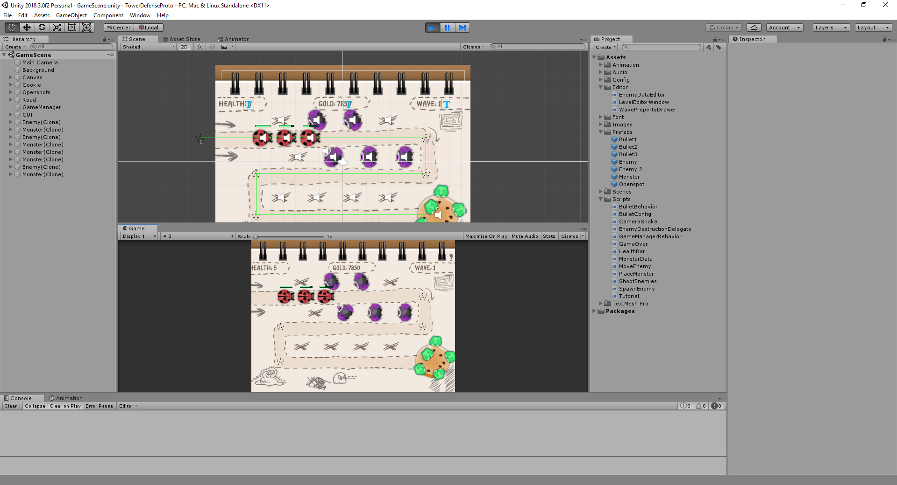

# Tower Defense Prototype Game for Unity

## Overview

The project whose goal is to build a 2D Tower Defense using Unity engine.

## Features:

* Custom Editor to define place put tower, waypoints enemy should go.
* Moving, Shooting, Health Bar...
* Using scriptable to improve memory use and easire for Game Designer changing.

### Changing. To do this:
1. Road to define waypoints
2. Openspots to define tower.
2. Game Manager.

## Upgrading

* To add more enemies.
* To add more tower.

## Android Setup

* Unity : 2018.3
* SDK : android-sdk-windows 
* JDK : jdk1.8.0_101

## Run the Project

To build and run on Android, click
**File > Build Settings**, select the **Android** platform, then
**Switch to Platform**, then **Build and Run**.

Or install the apk inside Bin\Android\

## Special Thanks

This section lists people who have contributed to this project by writing code, improving documentation or fixing bugs.

* [Reference](https://www.raywenderlich.com/269-how-to-create-a-tower-defense-game-in-unity-part-1) for tutorial
